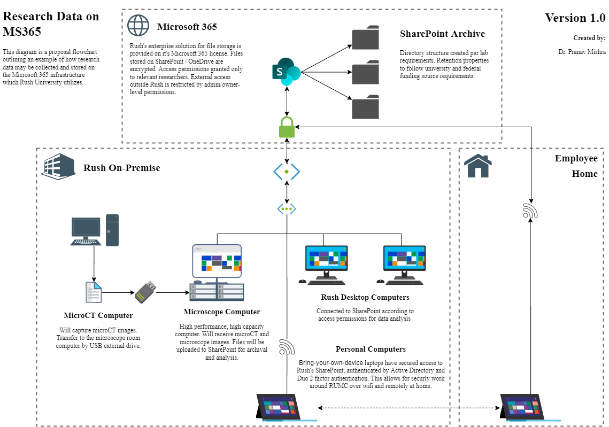

# Research Data Storage at Rush University

## Author Information

<strong>Pranav Kumar Mishra, MBBS</strong> 
Post-Doctoral Research Fellow 
Departments of Surgery and Orthopedic Surgery 
Rush University Medical Center

Email: pranav\_k\_mishra@rush.edu 
Office: 312-942-3146

 

## Purpose
The proper storage of files is essential for capturing, analyzing, and archiving research data for academic purposes. This repository is created to outline 'best practice' solutions which emphasize data integrity, redundancy, and ease-of-access.

## Rush Infrastructure
### Storing Large Data on Microsoft 365
Proposal of using the Microsoft 365 service (Sharepoint and OneDrive) for encrypted file storage.

### Flowchart of the BFGI Project's Data Storage
System in use for the Bone-Fat-Glucose Interface project:

